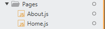
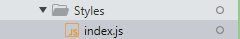

# Documentacion

## Primeros pasos

### Eliminar archivos

Eliminamos los archivos que no estaremos utilizando (App.css, App.test.js, logo.svg, reportWebVitals.js y setupTets.js)


En el archivo index.js eliminar la lineas de codigo de abajo hacia arriba desde la linea 17 hasta la 14, para luego eliminar la importacion de reportWebVitals que ya no estara disponible.

Seguimos al archivo App.js y eliminamos la importacion de logo, para luego dejar en el return de la funcion App lo siguiente:


    `<h1>Hola mundo</h1>`

Esto sera momentaneo 

### Instalar paquetes

Ya que el reto consiste en crear una aplicación SPA (Singe Page Application) con React.js, Apollo GraphQL y Styled Components y como ya creamos la app con React procederesmos a instalar Apollo GraphQL y Styled Components como indica cada una en sus respectivas documentaciones.

[Apollo](https://www.apollographql.com/docs/react/get-started/)

- npm install @apollo/client graphql

[styled-components](https://styled-components.com/docs/basics#installation)

- npm install --save styled-components

Adicionalmente instalaremos [react-router-dom](https://github.com/remix-run/react-router/blob/main/docs/getting-started/tutorial.md) para generar las rutas de las Pages

- npm i react-router-dom

### Inicializamos el Usuario de Apollo

¿Que es Apollo?

Apollo Client is a comprehensive state management library for JavaScript that enables you to manage both local and remote data with GraphQL. Use it to fetch, cache, and modify application data, all while automatically updating your UI.

Apollo Client helps you structure code in an economical, predictable, and declarative way that's consistent with modern development practices. The core library provides built-in integration with React, and the larger Apollo community maintains integrations for other popular view layers.@apollo/client

`Apollo Client es una biblioteca de administración de estado integral para JavaScript que le permite administrar datos locales y remotos con GraphQL. Úselo para obtener, almacenar en caché y modificar los datos de la aplicación, todo mientras actualiza automáticamente su interfaz de usuario.`

`Apollo Client le ayuda a estructurar el código de una manera económica, predecible y declarativa que es consistente con las prácticas de desarrollo modernas. La biblioteca principal proporciona integración integrada con React, y la comunidad Apollo más grande mantiene integraciones para otras capas de vista populares.@apollo/client`


para mas informacion les invito a visitar la documentacion de [Apollo-React](https://www.apollographql.com/docs/react/)


En este proyectos estaremos utilizando Apollo Client react hooks API reference, ya que no sera necesario instalar mas pquetes y React Apollo HOC API ya aparece como `deprecado`


Importamos las instacias que estaremos utilizando para ininializar el cliente de apollo 
```javascript
import { ApolloClient, InMemoryCache, ApolloProvider } from '@apollo/client'


const client = new ApolloClient({
  cache: new InMemoryCache(),
  uri: "https://rickandmortyapi.com/graphql"
})
```

envolvemos la app mediante el provider de apollo `ApolloProvider` para que el cliente este disponible en toda la app

```javascript
const root = ReactDOM.createRoot(document.getElementById('root'));
root.render(
  <React.StrictMode>
    <ApolloProvider client={client}> 
      <App />
    </ApolloProvider> 
  </React.StrictMode>
);
```

### Creacion de las rutas

Realizaremos la instalacion de `npm i react-router-dom` para poder hacer las rutas de las Pages, ya que contaremos con una ruta principal `/` donde estara ubicada la Pages Home y otra ruta `/About` donde estara la Pages About.


Siguientes Pasos

- Paso 1: Importar la estancia `BrowserRouter` de `react-router-dom` para poder envolver la app y funcione en todos los componentes que esten localizadon en app


```javascript
import {BrowserRouter} from 'react-router-dom'
```


```javascript
const root = ReactDOM.createRoot(document.getElementById('root'));
root.render(
  <React.StrictMode>
    <BrowserRouter>
      <ApolloProvider client={client}> 
        <App />
      </ApolloProvider>
    </BrowserRouter>
  </React.StrictMode>
);
```

Paso 2:Creamos la carpeta Pages donde estara ubicado Home y Abaout.



- Paso 3: Ir a App y solicitar las instancias `{Route, Routes}`  e importar las pages Home y Aabout para poder generar las rutas.

```javascript
import React from "react"
import {Route, Routes} from "react-router-dom";
import Home from "./Pages/Home.js"
import About from "./Pages/About.js"


function App() {

    return <>
      <Routes>
        <Route exact path='/' element={<Home/>} />
        <Route exact path='/About' element={<About/>} />
      </Routes>
    </>
  
}

export default App;
```


### Estrutura de la pagina


la SPA contara con los siguientes componentes:

- Navbar: Contara con nombre o logo del creador y un enlace para el About.
- Card: Se renderizara la informacion de los personajes solicitados a la api.
- Hisory: Componente donde estaran todos los personajes anteriormente generados.
- Footer: Informacion de contacto y enlaces a paginas de informacion del creador. 
- About: Dara informacion basica de que tecnologias se utilizaron para la creacion de la SPA


Podria quedar de la siguiente manera en App

```javascript

    return <Container>
      <Header>
        <Navbar/>
      </Header>
      <main>
        <Routes>
          <Route exact path='/' element={<Home/>} />
          <Route exact path='/About' element={<About/>} />
        </Routes>
      </main>
      <Footer/>
    </Container>

  </>
```

Comenzaremos creando el `Container` con styled-components.

Para ello primero crearemos la carpeta Styles que estara ubicada dentro de la carpeta src, quedando de la siguiente manera



luego en el archivo index.js de la carpeta Styles estaremos importando `styled-components` para luego crear el Container y darles los valores que veremos a continuacion:

```javascript
import styled from 'styled-components';

export const Container=styled.div`
    position: relative; /* la posicion relativa nos ayudara para hacer referecia al footer*/
    padding-bottom: 60px;
    min-height: 100vh;
```

### Navbar

Para el navbar solo colococar un contendor div con 2 enlaces uno pra ir a la pantalla principal y otro para ir al about. Para ellos se necesitaran la instancia de react-router-dom `Link` la cual funciona como un enlace a otra pagina.


```javascript
import React from "react"
import {Nav, DivNav} from "../Styles"
import {Link} from "react-router-dom"


const Navbar =()=>{

  return <Nav>
    <DivNav>
      <Link to="/" style={{textDecoration: "none", color:"black"}}>
        <h1>Jose Luis Rangel</h1>
      </Link>

      <Link to="/about" style={{textDecoration: "none", color:"black"}}>
        <h2>About</h2>
      </Link>

    </DivNav>

  </Nav>

}

export default Navbar;
```

ya no hare referencia a los `styled-components` ya que son un tema un poco extenso. Solo los mostrare nuevamente el el footter para finalizar con los mismos.


### Footer

La estructura del footer es muy parecida a la del Navbar ya que posee un contenedor con 2 enlaces que son direccionan otras 2 paginas informativas en este caso uno para mi cuenta en Github y la otra para mi linkedin

```javascript
import React from "react"
import {FooterStyle, ContainerFoo} from "../Styles"


const Footer =()=>{


  return <FooterStyle>
    <ContainerFoo>
          <a href="https://github.com/josrenyer" target="_blank" rel="noopener noreferrer"><li></li></a>
          <a href="https://www.linkedin.com/in/jl-rangel-fullstackdeveloper/" rel="noreferrer" target="_blank"><li></li></a>
        </ContainerFoo>
  </FooterStyle>

}

export default Footer;
```

```javascript
import styled from 'styled-components';

export const FooterStyle=styled.footer`
    width: 100%;
    position: absolute;   /*la posicion absoluta sera con referencia a quien lo contiene*/
    bottom: 0;
`
```

### Main

El main contendra las pages Home y About, donde Home a su vez contendra los Componentes Card y History

- Solicitar la data en Home mediante Apollo

Luego de haber compartido el cliente mediante el `ApolloProvider` importamos las siguientes instancias en la Pages Home

```javascript
import { gql, useLazyQuery  } from '@apollo/client';
```

glq: Nos servira para realizar el query que estaremos enviado para solicitar la informacion a la api.

useLazyQuery: Nos servira para solicitar informacion a la api cuando la solicitemos.

para mas informacion visitar la Docs


Visitamos la Docs de la [Api-RickAndMorty](https://rickandmortyapi.com/graphql) para saber la forma correcta de como se debe solicitar la informacion mediante query. En este caso para solicitar informacion de un solo Personaje

```javascript
const Character=gql`
  query character($random: [ID!]!){ //$random es una variables de tipo ID que nosotros estaremos
                                    //generando de forma dinamina para luego pasarla al query
    charactersByIds(ids: $random){
        id
        name
        status
        species
        gender
        origin{
          name
        }
        location{
          name
        }
        created
        image
    }
  }
`


function Home() {

  const [character, { called, loading, data }]= useLazyQuery(Character)

```

mas adelante invocaremos `character` mediante un handle, en la invocacion le pasaremos las variables.

```javascript
character({variables:{random: generator}})
```

generator sera un numero que la variable random tomara como ID para pasarla en la query como se indico anterioremante.


